## 行高
"行高"，顾名思义是指的一行文字的高度，按照我们的理解,行高指的应该是两行文字间基线的距离。
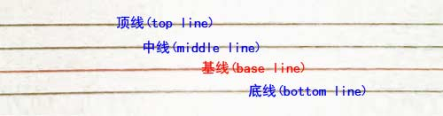
vertical-align中有top,middle,baseline,bottom与之是由关联的。但是由于中英文的差异，所以基线在中文中可能并不适用，实际表现不符合预期

### 行高的作用
CSS中起高度作用的除了我们熟知的height，另外line-height在css中也起了高度的作用，如果一个标签未定义高度（包括百分比高度），那么最终表现的高度一定是由line-height起作用的。

之前，在我的认知中，若不设置高度，父盒子的高度应该是由内层文字撑起来的，但是是不是这样呢?

我们来看一个实验：
```js
<div class="test1">测试</div>
<div class="test2">测试</div>

.test1 {
  font-size: 20px;
  line-height: 0;
  border:1px solid #cccccc; 
  background:#eeeeee;

  margin: 40px auto;
}

.test2 {
  font-size: 0;
  line-height: 20px;
  border:1px solid #cccccc; 
  background:#eeeeee;
}
```
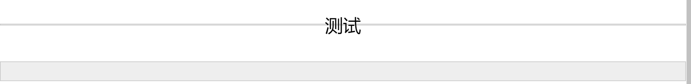

结果可以看出，div是由line-height撑开的，并不是我们之前认为的由文字撑开。

那么line-height是怎么产生高度的呢？在inline box中，有个line box（行框盒子）,line box没有其他特性，只有高度。所以一个没有设置高度的div的高度是由一个一个line box的高度堆砌而成。  

其实line box也不是真正的生产者，在它之中，还包含着一个inline box（内联盒子），包括span等... line box会取line-height最高的值来呈现。

### 行高的垂直居中性
行高还有一个重要特性，即垂直居中性。line-height的最终表现是通过line box（行框盒子）呈现的，而无论line box所占据的高度有多少，无论比文字大还是比文字小，它都会以文字的中垂线对称分布，我们就是利用这一特性来实现文字或图片的垂直居中。

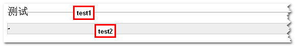

test1，line box高度为0，但是还是以文字的中垂线对称分布。

### 单行或多行文字居中的应用

#### 1.单行文字垂直居中
网上都是这么说的，把line-height值设置为height一样大小的值可以实现单行文字的垂直居中。这句话确实是正确的，但其实也是有问题的。问题在于height，看我的表述：“把line-height设置为您需要的box的大小可以实现单行文字的垂直居中”。  
```js
<p class="single_line">
        <span>单行文字居中</span>
</p>
.single_line {
  border: 1px dashed #cccccc;
}

.single_line span {
  line-height: 40px;
}
```
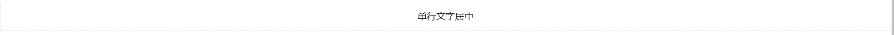

#### 2.多行文字垂直居中
之前常见的多行文字居中常见的有flex、table等，而现在，我们同样可以利用line-height来实现。因为行高的垂直居中性，并且它可以撑起盒子的高度，所以我们用line-height来代替外层盒子的height。
```js
<p class="mulit_line">
    <span style={{fontSize:12}}>
        Xx这里是高度为150像素的标签内的多行文字，文字大小为12Px。
        <br />
        这里是第二行，用来测试多行的显示效果。
    </span>
</p>
.mulit_line {
  line-height: 150px;
  border: 1px dashed #cccccc;
  padding-left: 5px;
}
.mulit_line span {
  display: -moz-inline-stack;
  display: inline-block;
  line-height: 1.4em;
  vertical-align: middle;
}
```
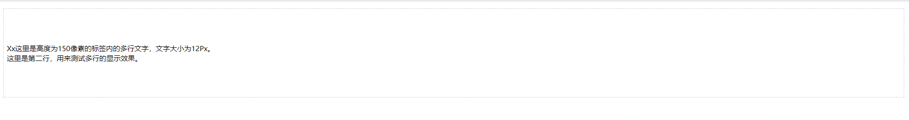
## line-height坑人的默认值：normal
line-height 的值可以是一个长度或者是一个数字，它的默认值是 normal。那么，normal 是什么呢？我们经常将 normal 理解为 1，或者 1.2，甚至连 CSS 规格文档都没有提到这一问题。
### font-size
一个简单的例子：
```js
<p>
    <span class="a">Ba</span>
    <span class="b">Ba</span>
    <span class="c">Ba</span>
</p>

p  { font-size: 100px }
.a { font-family: Helvetica }
.b { font-family: Gruppo    }
.c { font-family: Catamaran }
```
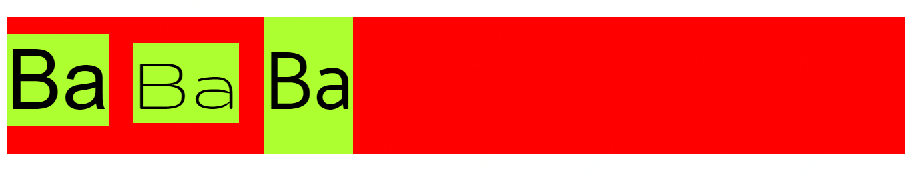
相同的font-size，得出的span高度却是不同的，这是为什么呢？  
原因在于字体本身，一款字体会定义一个em-square，它是用来盛放字符的容器，一般设定为宽高均为1000，但是也可能是1024、2048等
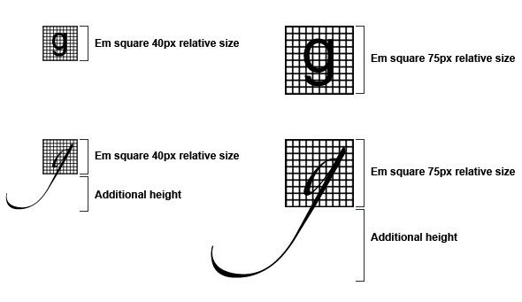
字体度量都是基于这个相对单位设置的，包括 ascender、descender、capital height、x-height 等。注意这里面的值是允许相对于 em-square 出去（bleed outside）的
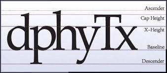
在浏览器中绘制时，字体会按照你的font-size缩放。

我们把 Catamaran 字体放到 FontForge 中，分析它的字体度量：
- em-square 是 1000
- ascender 是 1100，descender 是 540。通过测试发现，macOS 上的浏览器使用了 HHead Ascent 和 HHead Descent 值，Windows 上的浏览器使用了 Win Ascent 和 Win Descent（而且两个平台上的值不一样）。我们还看到 Capital Height 是 680，X height 是 485。
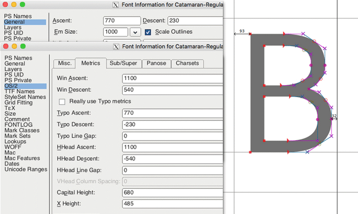

这意味着 Catamaran 字体占据了 1100 + 540 个相对单位，尽管它的 em-square 只有 1000 个相对单位，所以当我们设置 font-size:100px 时，这个字体里的文字高度是 164px。这个计算出来的高度决定了 HTML 元素的 content-area（内容区域）。你可以认为 content-area 就是 background 作用的区域。

我们还能看出大写字母的高度是 68px，小写字母的高度（x-height）是 49px。所以 1ex = 49px，1em = 100px，而不是 164px。（em 是基于 font-size，而不是基于计算出来的高度）

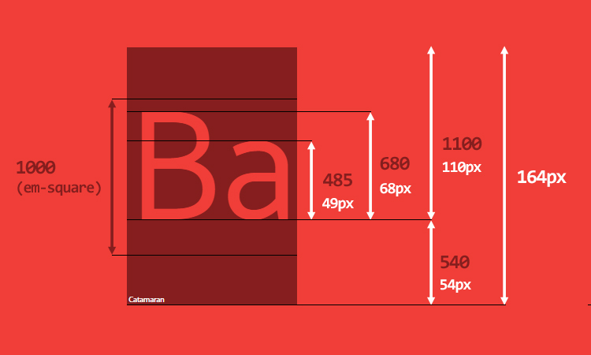

如果我们修改一下最初的 HTML 代码：
```js
<p>
    Good design will be better.
    <span class="a">Ba</span>
    <span class="b">Ba</span>
    <span class="c">Ba</span>
    We get to make a consequence.
</p>
```

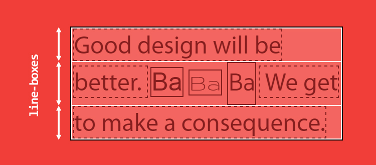

可以看到，第二行的高度略高，这就是之前提到的，line box会取最大的inline box的高度，而不是content-area的高度。

*这句话是什么意思呢？*
一个inline box（内联元素）包含两个高度：content-area和virtual-area（实际区域，可以理解成line-height，这是作者自定义的单词）
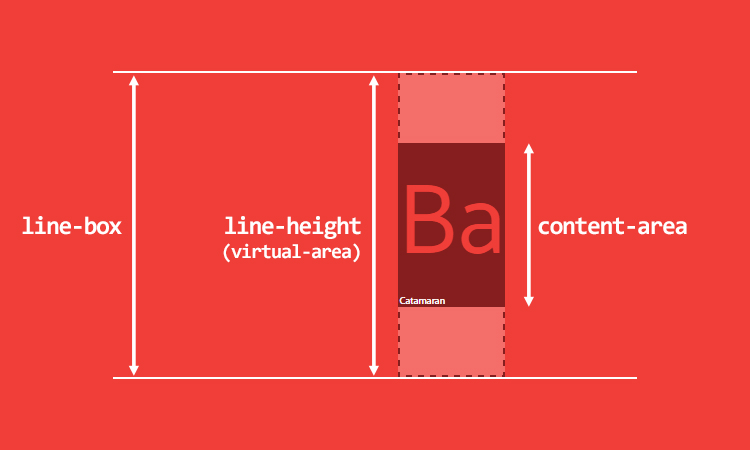

注：*按这种理解，line-height表示的并不是两个baseline之间的距离。个人感觉有些争议，，，*

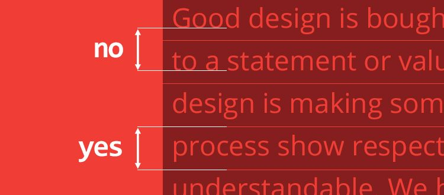

virtual-area 和 content-area 高度的差异叫做 leading。leading 的一半会被加到 content-area 顶部，另一半会被加到底部。因此 content-area 总是处于 virtual-area 的中间。

计算出来的 line-height（也就是 virtual-area 的高度）可以等于、大于或小于 content-area。如果 virtual-area 小于 content-area，那么 leading 就是负的，因此 line-box 看起来就比内容还矮了。

常见的内联元素：
- 可替换的内联元素，如 img / input / svg 等
- inline-block 元素，以及所有 display 值以 inline- 开头的元素，如 inline-table / inline-flex
- 处于某种特殊格式化上下文的内联元素，例如 flexbox 元素中的子元素都处于 flex formatting context（弹性格式化上下文）中，这些子元素的 display 值都是「blockified」

如果你将其 height 设置为 auto 的话，那么其高度的取值就是 line-height，其 content-area 的取值也是 line-height

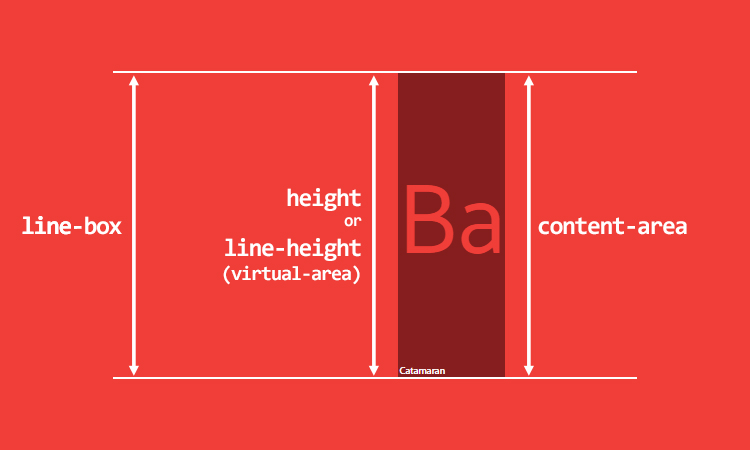

现在为止，还是没有解释line-height:normal。

回到上图：

除了EM Size还看到了许多其他值，

- 常规的 Ascent/Descent：ascender 是 770，descender 是 230，用于渲染字符。
- 规格 Ascent/Descent：ascender 是 1100，descender 是 540。用于计算 content-area 的高度
- 规格 Line Gap：用于计算 line-height: normal

在 Catamaran 这款字体中，Line Gap 的值是 0，那么 line-height: normal 的结果就跟 content-area 的高度一样，是 1640 相对单位。  
content-area 100/1000*(1100+540)

100px/1000个相对单位*(上半部分相对单位数量+下半部分单位数量)

为了对比，我们再看看 Arial 字体，它的 em-square 是 2048，ascender 是 1854，descender 是 434，line gap 是 67。那么当 font-size: 100px 时，

- 其 content-area 的高度就是 100/2048*(1854+434) = 111.72，约为 112px；
- 其 line-height: normal 的结果就是 100/2048*(67+1854+434) 约为 115px。

所有这些值都是由字体设计师设置的。

当 line-height 的值是一个数字时，其实就是相对 font-size 的倍数，而不是相对于 content-area。所以 line-height:1 很有可能使得 virtual-area 比 content-area 矮，从而引发很多其他的问题。

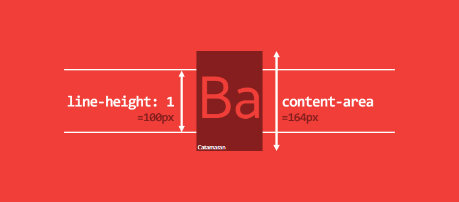

不仅仅是 line-height:1 有问题，电脑上的 1117 款字体中，大概有 1059 款字体的 line-height 比 1 大，最低的是 0.618，最高的是 3.378。这说明，字体之间行高差距非常大。

line-box 计算的一些细节：
- 对于内联元素，padding 和 border 会增大 background 区域，但是不会增大 content-area（不是 line-box 的高度）。一般来说你无法再屏幕上看到 content-area。margin-top 和 margin-bottom 对两者都没有影响。
- 对于可替换内联元素（replaced inline elements）、inline-block 元素和 blockified 内联元素，padding、margin 和 border 会增大 height（译者注：注意 margin），因此会影响 content-area 和 line-box 的高度

现在我们终于得到一个结果：line-height:normal是由字体计算得出，并且它会对line box的表现产生影响。

我得出的结论是，当我们要规定居中时，除了要考虑子元素的line-height，同时也要考虑父元素，因为父元素也有默认的normal，会对高度产生影响，所以我们在父元素中，用line-height取代height来呈现高度，能达到最好的结果

结束。。。。

参考文章：
- https://zhuanlan.zhihu.com/p/25808995
- https://www.zhangxinxu.com/wordpress/2009/11/css%e8%a1%8c%e9%ab%98line-height%e7%9a%84%e4%b8%80%e4%ba%9b%e6%b7%b1%e5%85%a5%e7%90%86%e8%a7%a3%e5%8f%8a%e5%ba%94%e7%94%a8/
