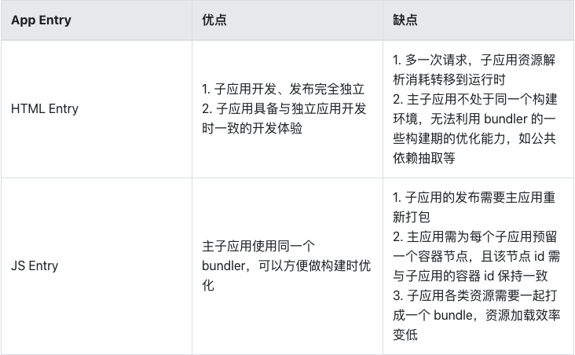

## 需要解决的问题点
1、子应用lazy load 之后，浏览器重新刷新，主框架资源重新加载，同时异步加载子应用； 因为异步加载子应用，所以会导致找不到路由的情况； 跳转NotFound页
解决方案，实现自己的路由劫持，动态路由功能，
2、子应用入口形式？
- jsEntry  VS Html Entry

3、应用隔离
- 样式隔离
  WebComments 的 Shandom Dom, 像弹框这种，需要把样式应用到body上的，就需要把样式暴露到主文档
  CSS Module  BEM
  约定前缀方式， 对新项目可行，但对老项目改动就稍大了；另外如果依赖三框架的不同版本，版本之间又有样式冲突，怎么办
  动态样式
  应用加载/卸载的同时，加载/卸载样式表，原理是浏览器会对所有样式表的插入、移除做整个 CSSOM 的重构，从而达到 插入、卸载 样式的目的

Html Entry 天然具备样式隔离
- JS 隔离
如何确保各个子应用之间的全局变量不会互相干扰，从而保证每个子应用之间的软隔离？
约定方式：全局变量通过约定特殊前缀或名称， 来避免冲突。因为人为因素太多，容易产生bug
全局快照
每次加载子应用时，给全局状态做一缓存备份，然后在应用卸载时，回退备份的缓存数据
