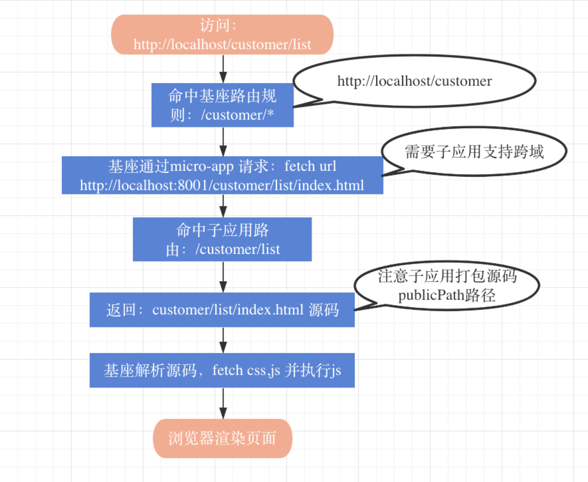

---
title: 微前端实践三（Micro-App落地）
date: 2021-09-09 14:49:25
tags:
- 微前端
categories: JS
author: zjk537
keywords: 微前端,模块联邦,wepack5,single-spa,micro-app
description: 微前端,模块联邦,wepack5,single-spa,micro-app
cover: https://img13.360buyimg.com/pop/jfs/t1/186410/34/7201/12974/60bf59c8Eb4d705c0/031ef90f70fcc962.webp
top_img: https://img13.360buyimg.com/pop/jfs/t1/186410/34/7201/12974/60bf59c8Eb4d705c0/031ef90f70fcc962.webp
---
## 微前端架构之Micro-App

经过前面一系列调研，最终决定使用京东出品的微前端框架Micro-App来落地我们的新项目

### 关于Micro-App
`single-spa`是通过监听 `url change` 事件，在路由变化时匹配到渲染的子应用并进行渲染，这个思路也是目前实现微前端的主流方式。同时`single-spa`要求子应用修改渲染逻辑并暴露出三个方法：`bootstrap`、`mount`、`unmount`，分别对应初始化、渲染和卸载，这也导致子应用需要对入口文件进行修改。因为`qiankun`是基于`single-spa`进行封装，所以这些特点也被`qiankun`继承下来，并且需要对`webpack`配置进行一些修改。

`micro-app`并没有沿袭`single-spa`的思路，而是借鉴了`WebComponent`的思想，通过`CustomElement`结合自定义的`ShadowDom`，将微前端封装成一个类`WebComponent`组件，从而实现微前端的组件化渲染。并且由于自定义`ShadowDom`的隔离特性，`micro-app`不需要像`single-spa`和`qiankun`一样要求子应用修改渲染逻辑并暴露出方法，也不需要修改`webpack`配置，相对接入微前端成本最低的方案。

Micro-App 概念图


### Micro-App的优势
1. 使用简单
它将所有功能都封装到一个类`WebComponent`组件中，从而实现在基座应用中嵌入一行代码即可渲染一个微前端应用，使用类似：`iframe`。
同时`Micro-App`还提供了`js沙箱`、`样式隔离`、`元素隔离`、`预加载`、`数据通信`、`静态资源补全`等一系列完善的功能。

2. 零依赖
`Micro-App`没有任何依赖，这赋予它小巧的体积和更高的扩展性。

3. 兼容所有框架
为了保证各个业务之间独立开发、独立部署的能力，`Micro-App`做了诸多兼容，在任何技术框架中都可以正常运行。

### 开始实战

[Micro-App官网](https://zeroing.jd.com/micro-app/docs.html#/)
Micro-App的官网写的太理想的，单看里面的一些介绍根本无从下手。
那我们再来一个官网的Demo: [GitHub: Micro-App](https://github.com/micro-zoe/micro-app.git)

很不幸，你从GitHub上下载下来的demo可以无法在本地顺利的运行，可能会遇到各种各样的问题，但是：你要把问题解决了，项目是可以运行起来的，而且效果还不错。具体遇到啥问题，咨询官方吧！不在本次分享范畴里。

> 项目背景
需求：做一个客户管理系统，简单描述功能模块：
  1、首页 工作台：统计客户昨日新增量，活跃度，发布消息数等
  2、客户信息管理：客户列表，基本信息维护，给客户发短信等
  3、系统日志：记录每个用户登录系统后的所有操作
  4、权限控制：用户权限不同，能访问的菜单也不同，页面内展示的模块，操作按钮等也不同


#### 一、安装依赖
**基座应用**
1、安装依赖
```js
npm i @micro-zoe/micro-app --save
```
2、引入依赖
```js
// index.js
import microApp from '@micro-zoe/micro-app'

microApp.start()
```
3、给子应用分配路由
```js
// router.js
import Vue from 'vue'
import VueRouter from 'vue-router'
import Customer from './customer.vue'

Vue.use(VueRouter)

const routes = [
  {
    // 非严格匹配，/customer/* 都将匹配到 Customer 组件
    path: '/customer/*', 
    name: 'customer',
    component: Customer,
  },
]

export default routes
```
4、在 customer.vue 页面中使用组件
``` html
<!-- customer.vue -->
<template>
  <div>
    <h1>客户管理</h1>
    <!-- url为html地址 (url只是html地址，子应用的路由还是基于浏览器地址) -->
    <micro-app name='customer' url='http://localhost:3001/' baseurl='/customer'></micro-app>
  </div>
</template>
```
**子应用**
1、添加路由前缀`(如果基座应用是history路由，子应用是hash路由，不需要设置路由前缀，这一步可以省略)`
```js
// mian.js
import Vue from 'vue'
import VueRouter from 'vue-router'
import routes from './router'

const router = new VueRouter({
  options: {
    // 添加路由前缀，子应用可以通过window.__MICRO_APP_BASE_URL__获取基座下发的baseurl
    base: window.__MICRO_APP_BASE_URL__ || '/',
  },
  routes,
})

let app = new Vue({
  router,
  render: h => h(App),
}).$mount('#app')
```
2、在webpack-dev-server的headers中设置跨域支持。`为什么要支持跨域访问？`
```js
devServer: {
  headers: {
    'Access-Control-Allow-Origin': '*',
  },
},
```
完成以上步骤微前端即可正常渲染。

> 注意：
1、name必传，name值不可以重复，它是区分子应用的标识
2、url必传，与子应用路由没任何关系，它只是子应用资源的访问地址，是html页面的地址哦
3、baseurl是基座应用分配给子应用的路由前缀，非必传，默认值为空字符串。
4、子应用必须支持跨域访问。

#### 二、主要功能
**1、配置项**
**name**: 必须， 子应用标识，全局唯一, `name` 值变化时，会卸载当前应用并重新渲染
**url**: 必须， 子应用访问地址：页面的访问地址：http://xxx.jd.com/appname/index.html; 基座会解析出页面中依赖的js、css 之后下载资源,并执行
**baseurl**:非必须 用于设置子应用的路由前缀，类似react-router中的 basename
``` js
<BrowserRouter basename={window.proxyWindow.__MICRO_APP_BASE_URL__ || '/'>
  <Switch>
    // ...
  </Switch>
</BrowserRouter>
```
其他配置，参考官方文档

**2、环境变量**
在子应用中通过 `window.proxyWindow.__MICRO_APP_ENVIRONMENT__` 变量判断是否在`micro-app`环境中。
```js
if (window.proxyWindow.__MICRO_APP_ENVIRONMENT__) {
  console.log('我在 micro-app 环境中渲染')
}

// window.proxyWindow 属性上，有基座注入到window上的全局变量，如：baseurl, public_path, appname,environment(是否Micro-app环境)

```
**3、数据通信**
- 1. 基座应用和子应用之间的通信
- 2. 全局通信

**基座应用和子应用之间的通信**
- 基座主动给子应用发送数据，基座主动问子应用要数据
- 子应用主动给基座发送数据，子应用主动问基座要数据

**1）基座应用 --`发送Data`--> 子应用**
- 方法一: 属性绑定
```js
<micro-app
  name="my-app"
  url="xx"
  :data="data" // data只接受对象类型，数据变化时会重新发送
/>
```
- 方法二：调用setData方法
```js
import microApp from '@micro-zoe/micro-app'

// 发送数据给子应用 appName
microApp.setData('appName', {type: '数据'})
```
**2）基座应用 --`获取Data`--> 子应用**
- 方法一：监听事件
```js
<micro-app
  name='appName'
  url='xxxxx'
  :data='data'
  // 数据在事件对象的detail.data字段中，子应用每次发送数据都会重新触发事件
  @datachange='handleDataChange'
/>
<script>
methods:{
  handleDataChange(data){
    // 处理子应用发送的数据
  }
}
<script>
```
- 方法二：手动绑定监听函数
```js
import microApp from '@micro-zoe/micro-app'

function dataListener (data) {
  console.log('来自子应用appName的数据', data)
}

/**
 * 绑定监听函数
 * appName: 应用名称
 * dataListener: 绑定函数
 * autoTrigger: 在初次绑定监听函数时有缓存数据，是否需要主动触发一次，默认为false
 */
microApp.addDataListener(appName: string, dataListener: Function, autoTrigger?: boolean)

// 解绑监听my-app子应用的函数
microApp.removeDataListener(appName: string, dataListener: Function)

// 清空所有监听appName子应用的函数
microApp.clearDataListener(appName: string)
```
- 方法三：
```js
microApp.getData(appName) // 返回子应用发送的data数据
```

**3）子应用 --`发送Data`--> 基座应用**

```js
// 数据是对象{}
window.microApp.dispatch({type: '子应用发送的数据'})
```


**4）子应用 --`拉取Data`--> 基座应用**
- 方法一：监听函数

```js
function dataListener (data) {
  console.log('来自基座应用的数据', data)
}
/**
 * 绑定监听函数
 * dataListener: 绑定函数
 * autoTrigger: 在初次绑定监听函数时有缓存数据，是否需要主动触发一次，默认为false
 * 补充: autoTrigger主要是为子应用提供的，因为子应用是异步渲染的，如果在子应用还没渲染时基座应用发送数据，子应用在初始化后不会触发绑定函数，但这个数据会放入缓存中，此时可以设置autoTrigger为true主动触发一次监听函数来获取数据。
 */
window.microApp.addDataListener(dataListener: Function, autoTrigger?: boolean)
// 对应基座的的
// microApp.setData('appName', {type: '数据'})


// 解除绑定
window.microApp.removeDataListener(dataListener)

// 清空所有当前应用的绑定函数
window.microApp.clearDataListener()

```
- 方法二：主动获取
```js
window.microApp.getData() // 返回data数据

```
**全局数据通信**
全局数据通信会向基座应用和所有子应用发送数据，在跨应用通信的场景中适用

**1）数据监听与解绑**
```js
// 基座中
import microApp from '@micro-zoe/micro-app'

function dataListener (data) {
  console.log('全局数据', data)
}

/**
 * 绑定监听函数
 * dataListener: 绑定函数
 * autoTrigger: 在初次绑定监听函数时有缓存数据，是否需要主动触发一次，默认为false
 */
microApp.addGlobalDataListener(dataListener: Function, autoTrigger?: boolean)

// 解除绑定
microApp.removeGlobalDataListener(dataListener)

// 清空所有全局数据的绑定函数
microApp.clearGlobalDataListener()


// 子应用

function dataListener (data) {
  console.log('全局数据', data)
}

/**
 * 绑定监听函数
 * dataListener: 绑定函数
 * autoTrigger: 在初次绑定监听函数时有缓存数据，是否需要主动触发一次，默认为false
 */
window.microApp?.addGlobalDataListener(dataListener: Function, autoTrigger?: boolean)

// 解除绑定
window.microApp?.removeGlobalDataListener(dataListener)

// 清空所有全局数据绑定函数
window.microApp?.clearGlobalDataListener()

// 注意: window.microApp 的判空操作
```
**2）发送数据**
```js
// 基座
import microApp from '@micro-zoe/micro-app'

microApp.setGlobalData({type: '全局数据'})

// 子应用
window.microApp?.setGlobalData({type: '全局数据'})

// 注意：window.microApp 判空
```

> 注意：
1、clearGlobalDataListener会清空所有应用的绑定，不仅限于自身
2、在子应用卸载时，需要调用removeGlobalDataListener主动解绑函数。

**4、路由**
**url属性与子应用路由的关系**  ``答：没关系``
`micro-app`不是`iframe`，不会重开一个`window`窗口，基座应用和子应用本质是在同一个页面渲染，所以影响到子应用路由的是浏览器地址。`micro-app`的`url`属性只是`html`的地址，它只是用来获取`html`。

基座应用：根据浏览器地址决定访问哪个子应用
子应用：根据浏览器地址，决定渲染哪个页面

例如：浏览器访问：http://localhost/customer/list
```js
// 基座路由配置
{ title:'客户管理', name:'customer', path:'/customer/*', view:'/customer.vue'},
// customer.vue
<template>
  <micro-app
    name='customer'
    url='http://localhost:8001/'>
  </micro-app>
</template>


// 子应用路由配置
{ title:'', name:'customerList', path:'/customer/list', view:'/customer/List.vue'},
// customer/List.vue
// 正常页面排版，js逻辑

```
页面访问及解析流程：


**几个例子**
- 1) 基座，子应用都是history模式
```js

// 浏览器地址为：http://localhost/page1/，此时路由地址为page1。
//    基座匹配路由 page1 渲染组件； 子应用 page1匹配 并渲染组件

// 基座micr-app配置, url 不包含page1, 路由还在浏览器地址栏取
// http://localhost:8001/ 会兜底到 http://localhost:8001/index.html
<micro-app url='http://localhost:8001/'></micro-app>

```
- 2) 基座 history 子应用 hash
```html
<!-- // 浏览器地址： http://localhost/appName#/page1 -->
<!-- // 这里的#/page1是无效的，应该添加到浏览器地址上 -->
<micro-app url='http://localhost:8001/#/page1'></micro-app>

<!-- // 这个url才是正确的 -->
<micro-app url='http://localhost:8001/'></micro-app>

```

- 3) 基座 history 子应用 history
```html
<!-- 子应用通过baseurl设置路由前缀，路由 /page1 就变为 /appNmae/page1 -->
<micro-app url='http://localhost:8001/' baseurl='/appNmae'></micro-app>

```

**注意**
- 1）基座是hash路由，子应用也必须是hash路由
- 2）基座是history路由，子应用可以是hash或history路由

**5、应用之间如何跳转**
因为每个应用的路由实例都是不同的，路由实例只能控制自身，无法影响其它应用，要实现应用之间的跳转有两种方式：

- **方法一：history.pushState(replaceState)**
`history.pushState`和`history.replaceState`可以直接修改浏览器地址，但是它们无法触发`popstate`事件，所以在跳转后需要主动触发一次`popstate`事件。
```js
// history 模式
history.pushState(null, null, 'page2')

// 主动触发一次popstate事件
window.dispatchEvent(new PopStateEvent('popstate', { state: null }))


// hash模式
history.pushState(null, null, '#/page2')

// 主动触发一次popstate事件
window.dispatchEvent(new PopStateEvent('popstate', { state: null }))
```

- **方法二：利用数据通信机制，让基座跳转路由**
如基座下发指令控制子应用进行跳转，或者子应用向基座应用上传一个可以控制自身路由的函数。


### QA

- **1、子应用一定要支持跨域吗？**
`是的！`
开发环境配置
```js
// webpack-devserver 中配置， 或 vue.config.js中
devServer: {
  headers: {
    'Access-Control-Allow-Origin': '*',
  },
},
```
线上环境，通过nginx配置解决

- **2、兼容性如何**
micro-app依赖于CustomElements和Proxy两个较新的API。

对于不支持CustomElements的浏览器，可以通过引入polyfill进行兼容，详情可参考：webcomponents/polyfills。

但是Proxy暂时没有做兼容，所以对于不支持Proxy的浏览器无法运行micro-app。

浏览器兼容性可以查看：[Can I Use](https://caniuse.com/?search=Proxy)

总体如下：

- PC端：除了IE浏览器，其它浏览器基本兼容。
- 移动端：ios10+、android5+

[官网问答](https://zeroing.jd.com/micro-app/docs.html#/zh-cn/questions)

参考文档
https://zeroing.jd.com/micro-app/docs.html
https://github.com/micro-zoe/micro-app.git